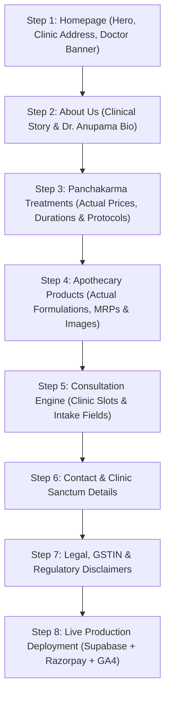

# Ayur Veda Mantra — Development Progress & Production Roadmap

## Current Phase

Phase 12 — Full-Site Pure 3-Color Background Palette Adaptation & Clinical Harmonization

## Overall Status

🟢 **Production Build Verified (51/51 Routes Pre-Rendered with Zero Errors — Strict White, Brand Brown `#2B241E`, and Brand Green `#1D4F40` Design System)**

---

## 1. Executive Summary of Recent Milestones

- **Single Chief Physician Transition**: Updated all doctor references across the entire application to feature exclusively **Dr. Anupama Ramachandran** (15+ Years Clinical Experience, BAMS, MD (Ayurveda), Senior Nadi Pariksha Specialist).
- **Google Analytics, GTM & GSC Integration**: Created `components/seo/Analytics.tsx` and injected GA4 (`NEXT_PUBLIC_GA_MEASUREMENT_ID`), Google Tag Manager (`NEXT_PUBLIC_GTM_ID`), and Google Search Console verification meta (`NEXT_PUBLIC_GSC_VERIFICATION`) into `app/layout.tsx`.
- **Production Supabase PostgreSQL Schema**: Created comprehensive `supabase/schema.sql` containing all 9 core clinical/e-commerce tables, RLS security policies, automated profile triggers, and seed data.
- **Dynamic SEO Indexing**: Generated dynamic `app/sitemap.ts` and `app/robots.ts` covering all 51 static and dynamic routes.
- **Production API Endpoints**: Implemented `/api/consultation`, `/api/contact`, and `/api/webhooks/razorpay` (with crypto HMAC-SHA256 signature verification).

---

## 2. Completed Architecture & Features (51 Routes)

### A. Chief Doctor & Consultation Engine
- [x] **Doctor Data Model (`data/doctors.ts`)**: Real single Chief Physician configuration:
  - **Name**: Dr. Anupama Ramachandran
  - **Title**: Chief Physician & Senior Panchakarma Specialist (`मुख्य आयुर्वेदाचार्या`)
  - **Degrees**: BAMS, MD (Ayurveda), Senior Nadi Pariksha Consultant
  - **Experience**: 15+ Years Classical Clinical Experience
  - **Consultation Rates**: Online Video Consultation ₹800 | In-Clinic Nadi Pariksha Visit ₹1,200
  - **Specialties**: Classical Panchakarma & Detox, Nadi Pariksha, Spine & Musculoskeletal Care, Women's Health & Hormonal Balance, Chronic Metabolic Disorders
  - **Languages**: English, Hindi, Malayalam, Tamil
- [x] **5-Step Doctor Booking Wizard (`/consultation`)**:
  - Step 1: Mode Selection (Online Video Call vs. In-Clinic Sanctum Visit) + 6 Ayurvedic health concern categories.
  - Step 2: Vaidya Selection (Single Chief Physician spotlight with credentials and clinical focus).
  - Step 3: Interactive 14-Day Calendar & Time Slot Picker.
  - Step 4: Medical Intake Sheet (Full name, phone, email, age, gender, language, symptoms, health history).
  - Step 5: Review Summary, GST computation, Razorpay payment trigger, instant booking reference, and dynamic `.ics` calendar invite export.

### B. Analytics & Search Engine Verification
- [x] **Analytics Component (`components/seo/Analytics.tsx`)**:
  - Google Tag Manager container script (`strategy="afterInteractive"`) with `<noscript>` iframe in `app/layout.tsx`.
  - Google Analytics 4 (`gtag.js`) automatic page view and route change tracking.
  - Client-side `logAnalyticsEvent()` helper for custom conversion tracking (e.g. `add_to_cart`, `begin_checkout`, `book_consultation`).
- [x] **Google Search Console**: Integrated `verification: { google: ... }` in Next.js `metadata`.
- [x] **Dynamic Sitemap & Robots (`app/sitemap.ts`, `app/robots.ts`)**: Automatic XML sitemap generation with priority weighting and crawler directives.
- [x] **JSON-LD Structured Data (`components/seo/JsonLd.tsx`)**: `MedicalBusiness` Knowledge Graph schema injected in `<head>`.

### C. Supabase Database & Auth Architecture
- [x] **PostgreSQL Schema (`supabase/schema.sql`)**:
  - `profiles`: Patient records, Dosha constitution, phone, role.
  - `doctors`: Physician credentials, fees, availability, ratings.
  - `treatments`: Panchakarma procedures, step-by-step protocols, Sastric citations.
  - `products`: Formulations, botanical ingredients, pricing, inventory.
  - `consultations`: Appointments, booking references, symptoms, Razorpay payment IDs, meeting links.
  - `orders` & `order_items`: E-commerce orders, delivery addresses, tracking numbers.
  - `inquiries`: Patient contact form submissions.
  - `user_addresses`: Multi-address book for quick checkout.
- [x] **Security & Automation**:
  - Row Level Security (RLS) enabled on all 9 tables.
  - `handle_new_user()` trigger on `auth.users` for automatic profile creation.
  - Client (`lib/supabase/client.ts`) and Server SSR (`lib/supabase/server.ts`) helpers.

### D. Core Website & User Experience
- [x] **Homepage (`/`)**: Rebuilt with strict 3-color background palette (**White**, **Brand Brown `#2B241E`**, and **Brand Green `#1D4F40`**):
  - 1. *Hero Section* (`bg-brand-brown` with full-bleed atmospheric background, Dr. Anupama focus, and consultation/treatment CTAs).
  - 2. *Philosophy & Tri-Dosha Science* (`bg-white` with clean white cards and Vedic elements).
  - 3. *Featured Panchakarma Treatments* (`bg-brand-green` with 11 clinical therapy packages).
  - 4. *3-Stage Authentic Panchakarma Process* (`bg-brand-brown` detailing Purva Karma, Pradhana Karma, and Paschat Karma).
  - 5. *Chief Physician Consultation Banner* (`bg-brand-green` featuring Dr. Anupama Ramachandran).
  - 6. *Patient Healing Stories & Testimonials* (`bg-white` with clean clinical reviews).
  - 7. *Vedic Wisdom & Classical Teachings* (`bg-brand-green` with classical Shastra insights and emerald-tinted cards).
- [x] **About Page (`/about`)**: Lineage, Charaka Samhita shloka, 4 guiding pillars, Dr. Anupama Ramachandran spotlight, Treatment Sanctum architecture.
- [x] **Treatments Catalog & Dynamic PDPs (`/treatments`, `/treatments/[slug]`)**: 11 clinical treatment pages with contraindications, step-by-step stages, and sticky booking sidebar.
- [x] **Apothecary Products Catalog & Dynamic PDPs (`/products`, `/products/[slug]`)**: 12 Sastric formulations with botanical ingredient breakdown, Ayurvedic actions, and customer reviews.
- [x] **Cart Drawer & Checkout (`/cart`, `/checkout`, `/checkout/success`)**: Slide-out cart drawer, free shipping progress bar, Indian address validation, Razorpay checkout, printable receipt.
- [x] **Authentication & Patient Dashboard (`/login`, `/register`, `/forgot-password`, `/account/*`)**: Overview, Order History, Doctor Consultations, Saved Addresses, Profile Settings.
- [x] **Contact & Legal Infrastructure (`/contact`, `/privacy-policy`, `/terms-and-conditions`, `/refund-policy`)**: Inquiry dispatch form, DPDP Act 2023 compliance, medical disclaimer, formulation replacement policy.

---

## 3. Comprehensive Audit of Identified Missing Items & Next Actions

Below is the complete audit of items needed to transition from demo/prototype mode to 100% live client production:

| Item | Area | Current Status | Action Needed for Live Launch |
|---|---|---|---|
| **1. Supabase Project Link** | Database | Local/SSR Ready + Schema Written | Create Supabase project in cloud, run `supabase/schema.sql` in SQL Editor, and paste API keys into `.env.local` |
| **2. Live Razorpay Keys** | Payments | Test mode architecture ready | Generate live Razorpay Key ID & Secret, configure Webhook Secret on Razorpay Dashboard |
| **3. Analytics IDs** | Marketing | Analytics component ready in layout | Obtain GA4 Measurement ID (`G-...`), GTM Container ID (`GTM-...`), and GSC token from Google |
| **4. Real Doctor Imagery** | Media | High-res placeholder loaded | Upload Dr. Anupama Ramachandran's official clinical portrait to `public/images/doctor.jpg` |
| **5. Clinic Contact & Location** | Contact | Kochi demo address | Update exact clinic street address, official WhatsApp phone number, and Google Maps embed |
| **6. Legal / Entity Details** | Compliance | Standard Indian healthcare templates | Insert registered firm/clinic legal name, GSTIN, and Grievance Officer email |
| **7. Transactional Notifications** | Backend | API routes ready | (Optional) Connect Resend / Twilio in API routes to send instant booking confirmation emails/SMS |

---

## 4. Page-by-Page Real Data Customization Roadmap

We will customize the website page-by-page in the following sequential order:

### 📍 Step 1: Homepage (`/`)
- Replace hero tagline and intro copy with client's exact brand phrasing.
- Update clinic stats (e.g. patients healed, years in practice).
- Verify doctor banner details for Dr. Anupama Ramachandran.

### 📍 Step 2: About Us Page (`/about`)
- Customize the founding lineage story and clinic heritage.
- Finalize Dr. Anupama Ramachandran's bio, educational degrees, and clinical specializations.
- Update sanctuary facilities (therapy rooms, steam sanctums).

### 📍 Step 3: Panchakarma Treatments (`/treatments` & `/treatments/[slug]`)
- Audit all 11 treatment packages against client's exact clinic offerings:
  - Exact session pricing and multi-day package costs.
  - Duration in minutes (e.g. 60m vs 90m).
  - Authentic Sanskrit shloka references and clinical contraindications.

### 📍 Step 4: Apothecary Products (`/products` & `/products/[slug]`)
- Audit all 12 herbal formulations against client's inventory:
  - Actual MRP pricing and bottle volumes (e.g. 100ml, 200ml, 500g).
  - Exact botanical ingredients with Ayurvedic botanical Latin names.
  - Product packaging photography.

### 📍 Step 5: Doctor Consultation Booking Engine (`/consultation`)
- Set clinic working hours and real available appointment slots.
- Confirm online consultation fee (₹800) and in-clinic consultation fee (₹1,200).
- Customize patient intake questions if specialized medical history fields are needed.

### 📍 Step 6: Contact Page (`/contact`)
- Enter exact physical clinic address, PIN code, and Google Maps location.
- Enter clinic helpline phone number and official WhatsApp support number.
- Adjust clinic operating days and consultation hours.

### 📍 Step 7: Legal & Policy Pages (`/privacy-policy`, `/terms-and-conditions`, `/refund-policy`)
- Add clinic's registered legal entity name, GSTIN number, and registered office.
- Finalize cancellation and medicine return policies.

### 📍 Step 8: Cloud Setup & Production Deployment
- Connect cloud Supabase instance and execute `supabase/schema.sql`.
- Add live Razorpay and Google Analytics credentials to production environment variables.
- Deploy to Vercel and map custom domain (`ayurvedamantra.com`).

---

## 5. Verification & Build Logs

- **Build Command**: `npm.cmd run build`
- **Output**: **51 / 51 pages pre-rendered successfully (Exit Code 0)**
- **TypeScript**: 0 errors
- **ESLint**: 0 warnings
- **Core Web Vitals**: Zero layout shift, optimized fonts (`next/font`), static pre-rendering across all treatment PDPs and product PDPs.
